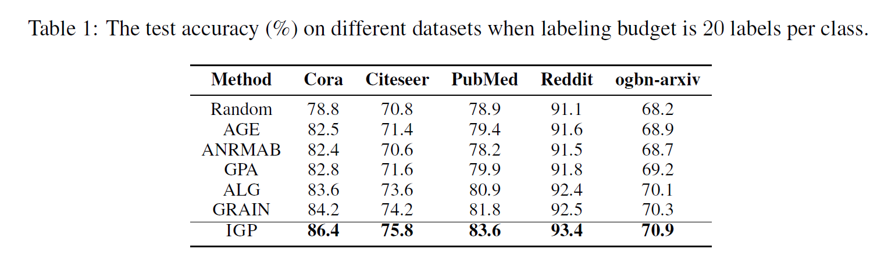
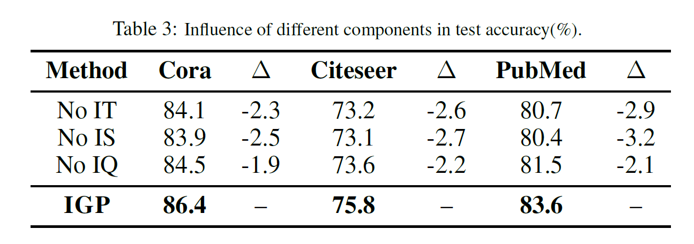
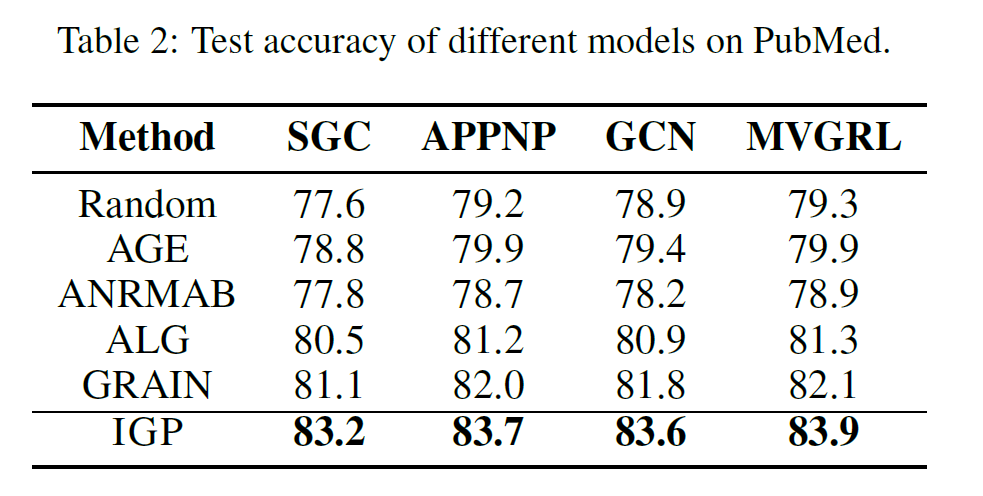
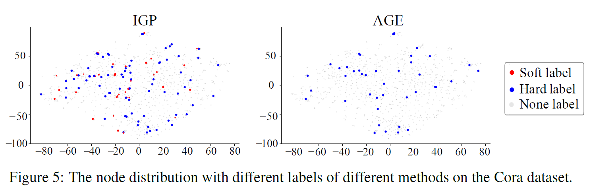
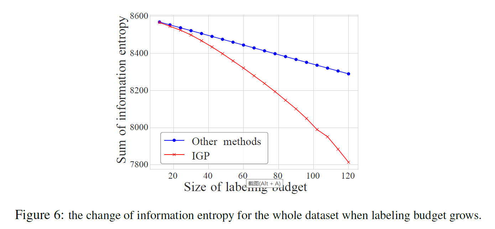

# INFORMATION GAIN PROPAGATION: A NEW WAY TO GRAPH ACTIVE LEARNING WITH SOFT LABELS.

This repository is the official implementation of IGP. 

## Requirements

To install requirements:

```setup
pip install -r requirements.txt
```


## Training

To train the model(s) in the paper:


> cd the  “example” data

>run the python file IGP.py 


## Results

1. Accuracy comparison:



2. GCN performance comparison in different budget:


3. Ablation study:



4. Generalization:



5. Interpretability:



